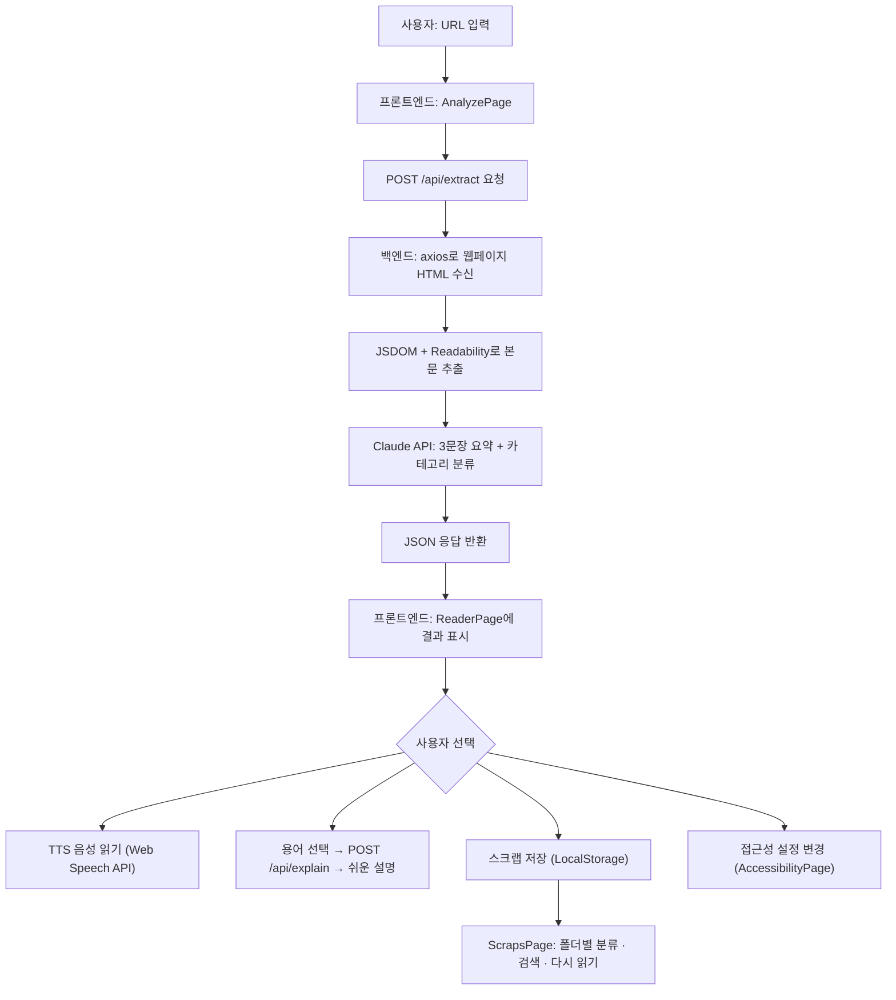

# AI 웹 페이지 요약 & 리더기 — 프로젝트 최종 보고서

---

## 1. 개요 및 목표

### 가. 프로젝트 기획 의도

인터넷에는 뉴스, 블로그, 공지사항 등 많은 정보가 있지만, 시각장애인이나 난독증 사용자는 긴 글을 읽는 데 상당한 어려움을 겪는다. 특히 광고, 메뉴, 댓글 등 불필요한 요소가 많은 웹페이지에서는 핵심 내용을 파악하기 어렵다. 본 프로젝트는 **"URL만 입력하면 AI가 본문을 추출하고, 핵심 내용을 요약하며, 음성으로 읽어 주는 웹 서비스"**를 만드는 것을 목표로 한다. 이를 통해 정보 접근성을 높이고, 누구나 웹 콘텐츠를 더 쉽게 이해할 수 있도록 돕고자 한다.

### 나. 최종 요구사항 및 기능 명세

| 항목 | 내용 |
|------|------|
| 프로젝트명 | AI 웹 페이지 요약 & 리더기 |
| 대상 사용자 | 시각장애인, 난독증 사용자, 긴 글을 빠르게 이해하고 싶은 일반 사용자 |
| 핵심 기능 | URL 입력 → 본문 추출 → AI 3문장 요약 → TTS 음성 읽기 → 접근성 UI → 용어 설명 → 스크랩·자동 분류 |
| 개발 형태 | React 기반 SPA(프론트엔드) + Express 기반 API 서버(백엔드) |

**주요 목표 기능 요약:**

1. 사용자가 URL을 입력하면 광고·메뉴·댓글을 제외한 핵심 본문만 추출한다.
2. Claude AI API를 활용하여 본문을 3문장으로 요약하고, 카테고리를 자동 분류한다.
3. Web Speech API를 통해 요약문/원문을 음성으로 읽어 주며 속도 조절이 가능하다.
4. 글꼴 크기, 자간, 줄 간격, 고대비 모드 등 접근성 UI 설정을 제공한다.
5. 어려운 단어를 선택하면 AI가 초등학생 수준의 쉬운 설명을 제공한다.
6. 스크랩/북마크 기능으로 글을 저장하고 주제별 자동 폴더링으로 관리한다.
7. 키보드 단축키(Alt+Shift 조합)로 마우스 없이 모든 기능을 사용할 수 있다.

---

## 2. 기능 구현 및 결과

### 가. 전체 시스템 흐름도



**시스템 구성:**
- **프론트엔드**: React + Mantine UI 컴포넌트, Vite 빌드 도구
- **백엔드**: Express 서버(포트 3001), Anthropic SDK, Readability 라이브러리
- **데이터 저장**: LocalStorage (접근성 설정, 스크랩 데이터)

### 나. 주요 기능 구현 내역

#### 기능 1: URL 입력 → 본문 추출 → AI 요약

**구현 내용:**
사용자가 분석 화면(AnalyzePage)에서 URL을 입력하고 "분석 시작하기" 버튼을 누르면, 프론트엔드가 백엔드의 `/api/extract` 엔드포인트에 POST 요청을 보낸다. 백엔드는 `axios`로 해당 URL의 HTML을 가져온 후, `JSDOM`과 Mozilla의 `Readability` 라이브러리를 사용하여 광고·메뉴·댓글 등 불필요한 요소를 제거하고 핵심 본문만 추출한다. 추출된 본문은 Claude API에 전달되어 3문장 요약과 카테고리 분류(정치, 경제, 사회, IT/기술, 생활/건강, 문화/예술, 기타)가 수행된다. 분석 진행 상태는 프로그레스 바를 통해 실시간으로 사용자에게 표시된다.

**예외 상황 처리:**
- URL이 비어 있을 경우 분석을 시작하지 않음 (`if (!url) return`)
- 서버 응답이 실패할 경우 `alert`와 `aria-live` 영역을 통해 오류 메시지 전달
- 크롤링이 차단된 페이지의 경우 백엔드에서 500 상태 코드와 에러 메시지 반환
- Readability 파싱 실패 시 `'Failed to extract content'` 에러 응답
- Claude API 키 미설정 시 요약 대신 안내 메시지 표시
- Claude API 응답이 JSON 형식이 아닐 경우 정규식 기반 폴백 파싱 수행

#### 기능 2: TTS 음성 읽기 및 재생 컨트롤

**구현 내용:**
읽기 화면(ReaderPage)에서 사용자는 "요약 읽기" 또는 "본문 읽기"를 `SegmentedControl`로 선택할 수 있다. Web Speech API의 `SpeechSynthesisUtterance`를 사용하여 선택한 텍스트를 음성으로 낭독하며, 재생/일시정지/처음부터 다시 듣기 버튼을 제공한다. 읽기 속도는 0.5x ~ 2.0x 범위의 슬라이더로 조절할 수 있고, 현재 속도가 실시간으로 표시된다.

**예외 상황 처리:**
- 분석된 데이터가 없을 경우 모든 음성 컨트롤 버튼이 `disabled` 처리
- 페이지 탭 전환 시 자동으로 `speechSynthesis.cancel()` 호출하여 음성 중지
- 키보드 단축키(Alt+Shift+P)로 재생/정지 토글 시, 데이터가 없으면 음성 안내

#### 기능 3: 접근성 UI 설정 (글꼴·자간·고대비)

**구현 내용:**
접근성 설정 화면(AccessibilityPage)에서 글꼴 크기(14~36px), 자간(-0.05~0.30em), 줄 간격(1.2~2.5)을 슬라이더로 세밀하게 조절할 수 있다. 고대비 모드를 활성화하면 배경색이 검정, 텍스트가 흰색, 주요 강조 요소가 노란색으로 전환되어 저시력 사용자의 가독성을 향상시킨다. "움직임 줄이기" 옵션은 모든 CSS 애니메이션과 트랜지션을 비활성화한다. 설정 자동 저장 기능이 기본 활성화되어 있어 LocalStorage에 자동으로 저장되며, 페이지를 새로고침해도 설정이 유지된다.

**예외 상황 처리:**
- LocalStorage 읽기/쓰기 실패 시 `try-catch`로 기본값 사용
- "기본값으로 되돌리기" 버튼으로 모든 설정을 초기화할 수 있음
- 접근성 설정 변경 시 스크린 리더에 `aria-live` 영역으로 변경 사실 안내

#### 기능 4: 용어 설명 (쉬운 단어 풀이)

**구현 내용:**
읽기 화면의 본문에서 사용자가 어려운 단어를 드래그하거나 더블클릭으로 선택하면, 우측 "용어 설명" 패널에 선택한 단어가 표시된다. "쉬운 설명 보기" 버튼을 누르면 백엔드의 `/api/explain` 엔드포인트가 호출되고, Claude AI가 해당 단어를 초등학생 수준의 쉬운 말로 설명하고 일상생활 예시 문장도 함께 제공한다. 설명 생성 시 본문 문맥(최대 1,000자)을 함께 전달하여 문맥에 맞는 설명을 생성한다.

**예외 상황 처리:**
- 단어가 2자 미만이거나 20자 이상일 경우 선택을 무시
- API 호출 실패 시 "단어 설명을 가져오지 못했습니다" 메시지 표시
- 단어 미선택 시 예시 단어("접근성")와 설명을 기본 표시

#### 기능 5: 스크랩/북마크 및 자동 폴더링

**구현 내용:**
읽기 화면에서 "스크랩" 버튼을 누르면 현재 분석된 기사가 LocalStorage에 저장된다. 스크랩 보관함(ScrapsPage)에서는 저장된 글을 카드 형태로 볼 수 있으며, AI가 분류한 카테고리(정치, 경제, 사회 등)에 따라 자동으로 폴더 분류된다. 폴더 탭 버튼을 통해 특정 카테고리만 필터링할 수 있고, 검색 기능으로 제목이나 요약 내용을 검색할 수 있다. 각 스크랩 카드에서 "다시 읽기"로 읽기 화면에서 불러오거나, "삭제"로 제거할 수 있다.

**예외 상황 처리:**
- 이미 스크랩된 글을 다시 스크랩하면 자동으로 해제(토글 방식)
- 스크랩된 글이 없는 카테고리 폴더는 화면에서 자동 숨김(전체, 기타는 항상 표시)
- 검색 결과가 없을 경우 안내 메시지 표시
- 키보드 단축키(Alt+Shift+K)로도 스크랩 등록/해제 가능

#### 기능 6: 키보드 접근성 및 스크린 리더 지원

**구현 내용:**
모든 기능을 마우스 없이 키보드만으로 사용할 수 있도록 전역 단축키를 구현했다. Alt+Shift+1~4로 각 탭 이동, Alt+Shift+P로 음성 재생/정지, Alt+Shift+S로 음성 정지, Alt+Shift+K로 스크랩 토글이 가능하다. 모든 상태 변화는 `aria-live="assertive"` 영역을 통해 스크린 리더에 즉시 전달된다. 모든 버튼과 입력 요소에 `aria-label`을 부여하여 스크린 리더가 요소의 용도를 정확히 안내할 수 있다.

**예외 상황 처리:**
- 데이터가 없는 상태에서 음성 재생 시도 시 안내 메시지 음성 출력
- 단축키 안내 패널을 화면 하단에 항상 표시하여 사용법을 안내

---

## 3. 서비스 연동 및 데이터 처리

### 가. 외부 서비스 연동 내역

| 서비스 | 용도 | 연동 방식 |
|--------|------|-----------|
| **Anthropic Claude API** | 본문 3문장 요약, 카테고리 분류, 어려운 용어 설명 | `@anthropic-ai/sdk` 패키지를 사용하여 백엔드에서 호출. API 키는 `.env` 파일로 관리 |
| **Web Speech API** | TTS 음성 읽기 | 브라우저 내장 `SpeechSynthesisUtterance` API를 프론트엔드에서 직접 호출 |
| **Mozilla Readability** | 웹페이지 본문 추출 | `@mozilla/readability` + `jsdom`을 사용하여 HTML에서 광고·메뉴 등 제거 |
| **axios** | 외부 웹페이지 HTML 수신 | 백엔드에서 사용자가 입력한 URL의 HTML을 HTTP GET 요청으로 가져옴 |

### 나. 데이터 처리 방법

**프론트엔드 → 백엔드 데이터 흐름:**

1. **URL 분석 요청**: 프론트엔드가 `POST /api/extract`에 `{ url }` JSON을 전송한다. 백엔드는 해당 URL의 HTML을 가져와 Readability로 본문을 추출하고, Claude API로 요약·카테고리 분류를 수행한 후, `{ title, content, textContent, excerpt, siteName, summary, category }` 형태의 JSON으로 응답한다.

2. **용어 설명 요청**: 사용자가 선택한 단어와 본문 문맥(최대 1,000자)을 `POST /api/explain`에 `{ word, context }` JSON으로 전송한다. Claude API가 쉬운 설명과 예시 문장을 생성하여 `{ word, definition, example }` 형태로 응답한다.

3. **로컬 데이터 저장**: 접근성 설정(`accessibility-settings`)과 스크랩 목록(`article-scraps`)은 브라우저의 LocalStorage에 JSON 형태로 저장한다. 페이지 로드 시 저장된 데이터를 읽어 초기 상태를 복원한다. 자동 저장 옵션이 활성화된 경우, 설정 변경 시마다 즉시 LocalStorage에 반영된다.

4. **상태 관리**: React의 `useState`로 전역 상태(분석 데이터, TTS 상태, 설정, 스크랩)를 `App.tsx`에서 관리하고, 각 페이지 컴포넌트에 props로 전달하는 Lifting State Up 패턴을 사용한다.

---

## 4. 유지보수 계획

### 가. 주요 핵심 코드 설명

**1) 백엔드 본문 추출 및 AI 요약 (`server/index.ts`)**

```typescript
// 웹페이지 HTML을 가져와 본문만 추출하는 핵심 로직
const response = await axios.get(url, {
  headers: {
    'User-Agent': 'Mozilla/5.0 ...',  // 크롤링 차단 방지
  },
});
const dom = new JSDOM(response.data, { url });
const reader = new Readability(dom.window.document);
const article = reader.parse();  // 광고·메뉴 제거 후 본문만 추출

// Claude API로 3문장 요약 + 카테고리 분류 요청
const msg = await anthropic.messages.create({
  model: "claude-3-5-sonnet-20240620",
  max_tokens: 1024,
  messages: [{ 
    role: "user", 
    content: `본문을 3문장으로 요약하고 카테고리를 분류해줘...
    본문: ${article.textContent.slice(0, 10000)}`
  }],
});
```

이 코드는 외부 URL에서 HTML을 가져오고, Readability로 핵심 본문을 파싱한 뒤, Claude AI에게 요약과 카테고리 분류를 요청하는 핵심 파이프라인이다. 본문은 10,000자로 제한하여 API 토큰 비용을 절약한다.

**2) 프론트엔드 TTS 음성 읽기 (`App.tsx`)**

```typescript
const handleSpeak = () => {
  if (!articleData) return;
  window.speechSynthesis.cancel();  // 기존 음성 중지
  
  // 요약 또는 원문 중 선택된 텍스트를 읽기
  const textToRead = readTarget === 'summary' 
    ? articleData.summary : articleData.textContent;
  const utterance = new SpeechSynthesisUtterance(textToRead);
  utterance.rate = speechRate;  // 사용자가 설정한 속도 적용
  utterance.onstart = () => setIsPlaying(true);
  utterance.onend = () => setIsPlaying(false);
  window.speechSynthesis.speak(utterance);
};
```

이 코드는 Web Speech API를 활용하여 별도 외부 TTS 서비스 없이 브라우저 내장 기능으로 음성 낭독을 구현한다. 요약문과 원문을 선택적으로 읽을 수 있으며, 사용자가 설정한 속도(0.5x~2.0x)를 적용한다.

**3) 접근성 설정 자동 저장 (`App.tsx`)**

```typescript
const handleChangeSetting = <K extends keyof AccessibilitySettings>(
  key: K,
  value: AccessibilitySettings[K]
) => {
  setSettings((prev) => {
    const next = { ...prev, [key]: value };
    if (next.autoSave) {
      localStorage.setItem('accessibility-settings', JSON.stringify(next));
    }
    return next;
  });
};
```

이 코드는 TypeScript 제네릭을 활용하여 타입 안전한 설정 변경 함수를 구현한다. 자동 저장이 활성화되어 있으면 변경 즉시 LocalStorage에 반영하여 사용자 경험을 향상시킨다.

### 나. 유지보수 계획

| 항목 | 계획 |
|------|------|
| **코드 구조** | 현재 페이지 단위로 컴포넌트가 분리되어 있어(`AnalyzePage`, `ReaderPage`, `AccessibilityPage`, `ScrapsPage`) 기능별 독립적인 수정이 가능하다. 향후 공통 UI 컴포넌트(버튼, 카드 등)를 `components/` 폴더로 추가 분리할 계획이다. |
| **상태 관리** | 현재 `App.tsx`에서 Lifting State Up 패턴으로 전역 상태를 관리한다. 기능이 더 복잡해지면 Context API 또는 Zustand 등 상태 관리 라이브러리 도입을 고려한다. |
| **백엔드 확장** | Express 서버의 각 API 엔드포인트를 별도 라우터 파일로 분리하고, 에러 핸들링 미들웨어를 공통화할 계획이다. |
| **데이터 저장소** | 현재 LocalStorage를 사용하지만, 다중 기기 동기화가 필요할 경우 Supabase 또는 Firebase 등 클라우드 DB로 전환할 계획이다. |
| **AI 모델 업데이트** | Claude API 모델 버전이 업데이트되면 `server/index.ts`의 모델명만 변경하면 되도록 환경변수로 관리할 수 있게 개선할 계획이다. |
| **테스트** | 향후 Vitest + Testing Library를 사용하여 주요 기능의 단위 테스트를 추가할 계획이다. |

---

## 5. 결론 및 고찰

### 가. 최종 시연 결과

본 프로젝트는 다음과 같은 시연 시나리오를 통해 전체 기능의 동작을 검증하였다.

**시연 시나리오:**
1. 메인 화면에서 뉴스 기사 URL을 입력하고 "분석 시작하기" 버튼을 클릭한다.
2. 프로그레스 바가 진행되며 본문 추출 → AI 요약이 완료되면 자동으로 읽기 화면으로 전환된다.
3. 읽기 화면에서 AI가 생성한 3문장 요약을 확인하고, 원문 본문도 함께 확인한다.
4. 음성 리더 패널에서 "요약 읽기"를 선택하고 재생 버튼을 눌러 TTS 음성 낭독을 시연한다.
5. 읽기 속도 슬라이더를 1.5x로 변경하여 빠른 읽기를 시연한다.
6. 본문에서 어려운 단어를 드래그하고 "쉬운 설명 보기"를 눌러 용어 설명을 확인한다.
7. "스크랩" 버튼으로 기사를 저장한 후, 스크랩 보관함에서 자동 분류된 결과를 확인한다.
8. 접근성 설정에서 글꼴 크기를 28px로 늘리고, 고대비 모드를 활성화하여 시각적 변화를 확인한다.
9. Alt+Shift+1~4 단축키로 탭 이동, Alt+Shift+P로 음성 재생/정지를 시연한다.

### 나. 고찰

**목표 달성도:**

본 프로젝트는 기획 단계에서 설정한 핵심 목표를 대부분 달성하였다. URL 입력만으로 본문 추출, AI 요약, TTS 음성 읽기, 접근성 UI 설정, 용어 설명, 스크랩/자동 분류, 키보드 단축키 등 7가지 주요 기능을 모두 구현하였다. 특히 시각장애인을 위한 `aria-live` 실시간 음성 안내와 고대비 모드, 키보드 전용 네비게이션은 접근성이라는 프로젝트의 핵심 가치를 충실히 반영하였다.

다만, 백엔드 Claude API 모델명 호환성 이슈(`claude-3-5-sonnet-20240620`)가 발견되어 실제 서비스 배포 시 모델명 검증이 필요하다. 또한 로그인이 필요한 웹페이지나 JavaScript로 동적 렌더링되는 SPA 페이지의 경우 본문 추출이 제한되는 한계가 있다.

**추후 심화 연구 방향:**

1. **다국어 지원 확대**: 현재 한국어 중심이지만, 영어·일본어 등 다국어 웹페이지 요약 및 TTS를 지원하여 글로벌 접근성을 확보한다.
2. **사용자 인증 및 클라우드 동기화**: 현재 LocalStorage 기반 저장을 Supabase 등 클라우드 DB로 전환하여 다중 기기에서 스크랩과 설정을 동기화한다.
3. **브라우저 확장 프로그램**: 현재 URL을 복사하여 입력해야 하는 불편함을 해소하기 위해, 크롬 확장 프로그램으로 개발하여 현재 보고 있는 페이지를 바로 분석할 수 있도록 한다.
4. **고급 TTS 엔진**: Web Speech API 대신 Google Cloud TTS나 NAVER Clova Voice 등 고품질 TTS를 도입하여 더 자연스러운 음성을 제공한다.
5. **PDF·문서 파일 지원**: URL 외에 PDF, DOCX 등 문서 파일도 업로드하여 요약·음성 읽기를 지원한다.
6. **접근성 인증 획득**: WCAG 2.1 AA 기준을 만족하도록 접근성 감사를 수행하고, 실제 시각장애인 사용자 테스트를 통해 UX를 개선한다.

---

> **기술 스택 요약**
> 
> | 영역 | 기술 |
> |------|------|
> | 프론트엔드 | React, TypeScript, Mantine UI, Vite |
> | 백엔드 | Express, TypeScript, tsx |
> | AI 요약/설명 | Anthropic Claude API (`@anthropic-ai/sdk`) |
> | 본문 추출 | Mozilla Readability, JSDOM, axios |
> | TTS 음성 | Web Speech API (브라우저 내장) |
> | 데이터 저장 | LocalStorage |
> | 접근성 | WAI-ARIA, 키보드 단축키, 고대비 모드, 스크린 리더 지원 |
